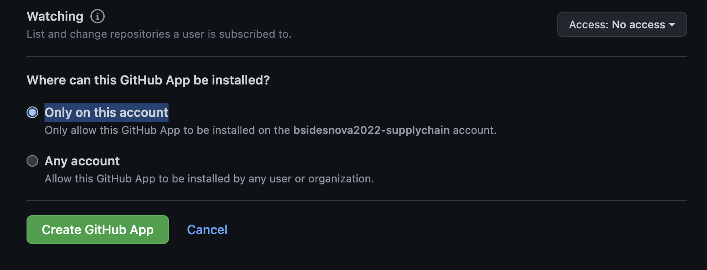
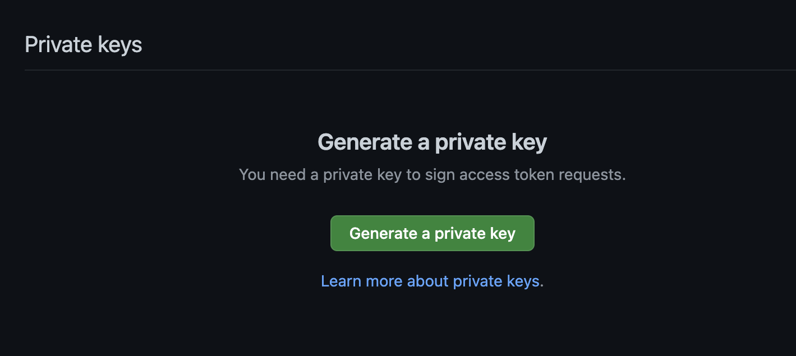

# GitHub

OpenUnison can be used to with GitHub in three important ways:

1. Use GitHub as an authentication source for developers interacting with your clusters and cluster management applications
2. Use GitHub teams to manage access to your namespaces when using Namespace as a Service
3. Provision access to your GitHub organization, as well as repositories, secrets, and keys


## Authentication

Using GitHub for authentication is easy, just follow the instructions to [Deploy the Authentication Portal](/deployauth), and choose [GitHub](deployauth/#github) when you configure your identity provider.  You'll be able to reference your teams in RBAC bindings.

## Using Github Teams in Namespace as a Service

You can use your GitHub teams when using the OpenUnison Namespace as a Service portal to control access to namespaces.  You can configure your NaaS portal to lookup teams so you don't need to type them out.

***INSTRUCTIONS***

## Provisioning Access and Resources to GitHub

Why use OpenUnison to provision access to GitHub?  GitHub is often an instrumental part of any Kubernetes deployment, especially when talking about GitOps!  If you want to automate GitOps with self service, you'll also want to automate the creation and integration of GitHub repositories and integration with your GitOps controller.  For example, take an example where you want to give developers a personal namespace to do development.  The developer will need:

1. GitHub repository for the application
2. Github repository for the application's manifests
3. An `Application` in ArgoCD
4. SSH keys to integrate all of these components

You could script all this, but OpenUnison simplifies this integration by automating the deployment without having an administrator get involved!  Here's a quick demo of this in action:

***DEMO of BSIDESNOVA***

### Creating a GitHub Provisioning Target

OpenUnison communicates with GitHub via a GitHub App.  This provides for shorter lived tokens and provides increased security for integrating with GitHub.  Before configuring your OpenUnson `Target`, register a new GitHub App:

#### Registering a GitHub App

The first step is to go to your organization's settings and click on **GitHub Apps**:


Next, click on **New GitHub App**:


You'll likely be asked to re-authenticate or use the GitHub mobile app to verify your identity.  Next, choose a name and set a description.  You're required to provider a URL, but this can point to anything.  Skip the callback URL, OpenUnison doesn't need it.  Keep **Expire user authentication tokens** checked.  Keep **Request user authorization (OAuth) during installation** and **Enable Device Flow** unchecked.  Uncheck **Active** under **WebHook**.

Next, you'll need to set permissions for the app.  Which ones you need depends on what you want to be able to do.  If you want to just use this connection with GitHub to read teams:

| Location | Feature | Permission |
| -------- | ------- | ---------- |
| Organization permissions | Administration | Read Only |
| Organization permissions | Members | Read Only |

If you want to be able to provision users into teams:

| Location | Feature | Permission |
| -------- | ------- | ---------- |
| Organization permissions | Administration | Read and Write |
| Organization permissions | Members | Read and Write |

Each of the tasks below will require additional permissions.  You can update these permisions later too.

Finally, after permissions and under **Where can this GitHub App be installed?** choose **Only on this account** and click **Create GitHub App**:



Once your app is created, the next step is to create a private key.  Skip the **Client secrets** section, using static secrets is not the preferred way to interact with the GitHub api and OpenUnison automates token management for you.  Scroll to the bottom where you'll find **Private keys** and click **Generate a private key**:



That will generate and downlaod a PEM file.  Rename this file to something that works for a Kubernetes `Secret` and create a `Secret` from it in the **openunison** namespace.  Next, click on **Install App**, choose your organization and click **Install**:


Once your app is installed, make a note of the **App ID**:


Finally, create a `Target` in the openunison namespace:

***ADD DOCS FOR ENTERPRISE***

```yaml
apiVersion: openunison.tremolo.io/v1
kind: Target
metadata:
  name: github
  namespace: openunison
spec:
  className: com.tremolosecurity.provisioning.core.providers.GitHubProvider
  params:
  - name: appid
    value: "XXXXXX"
  - name: org
    value: "my-orgianization-name"
  secretParams:
  - name: githubAppKey
    secretName: secret-that-you-created
    secretKey: name-of-pem-file
  targetAttributes:
  - name: sub
    source: sub
    sourceType: user
```

At this point, OpenUnison will be able to interact with your GitHub instance.  You can use any of the below tasks in your workflows.  If you want to add permissions to your app after it's installed, you'll need to re-authorize it:

***ADD REAZ***

#### Create Repository

This task will generate a repository and create a deployment key that can be used in other tasks throughout the workflow.

```yaml
- taskType: customTask
  className: com.tremolosecurity.provisioning.customTasks.github.CreateGithubRepo
  params:
    targetName: github
    name: $github_user$-workshop-application
    description: project for supplychain workshop
    team: admin-$github_user$-workshop
    # optional paramters
    # allowSquashMerge: "true"
    # allowMergeCommit: "true"
    # allowRebaseMerge: "true"
    # deleteBranchOnMerge: "false"
    # defaultBranch: "main"
    # homePage: "https://www.tremolosecurity.com/"
    # visibility: "public"
    # issues: "true"
    # projects: "true"
    # wiki: "true"
    # downloads: "true"
    # isTemplate: "false"
    # gitignoreTemplate: ""
    # licenseTemplate: ""
    # autoInit: "true"
    # owner: ""
    # deployKeyName: "deployment-key"
    # webhookUrl: ""
    # webhookEvents: []
```

##### Required Permissions

In order for your GitHub App to use this API, enable:

| Location | Feature | Permission |
| -------- | ------- | ---------- |
| Repository permissions | Administration | Read and Write |
| Repository permissions | Webhooks | Read and Write |

##### Generated Request Objects

This task generates several objects that get added to the workflow request object.  These can then be used by other tasks later in the workflow.

| Request Object Name | Example | Description |
| ------------------- | ------- | ----------- |
| `gitSshUrl`         | git@github.com:bsidesnova2022-supplychain/unison-test-user-3-workshop-infrastructure.git | The SSH git URL for the generated repository |
| `gitPrivateKey`     | SSH Private Key | The plain text version of the ssh key created for this repo |
| `base64SshPrivateKey` | Base64 Encoded key | The base 64 encoded version of the private key, useful for creating `Secret` objects |

#### Add Team to Repository

This task will add a team to a repository with the given permissions 

```yaml
- taskType: customTask
  className: com.tremolosecurity.provisioning.customTasks.github.AddTeamToRepo
  params:
    targetName: github
    teamName: admin-$github_user$-workshop
    repoName: $github_user$-workshop-application
    # Can be admin, triage, read, write
    permission: admin
```  

##### Required Permissions

In order for your GitHub App to use this API, enable:

| Location | Feature | Permission |
| -------- | ------- | ---------- |
| Repository permissions | Administration | Read and Write |


#### Create Git File

This task allows you to create a single file in your repository.  Useful if you need to create a README or other file when initializing a repository.

```yaml
- taskType: customTask
  className: com.tremolosecurity.provisioning.customTasks.github.CreateGitFile
  params:
    targetName: github
    repository: $github_user$-workshop-application
    branch: main
    commitMessage: initial create
    path: README.md
    content: |-
      #Project

      This is a very important project
```

##### Required Permissions

In order for your GitHub App to use this API, enable:

| Location | Feature | Permission |
| -------- | ------- | ---------- |
| Repository permissions | Administration | Read and Write |
| Repository permissions | Contents | Read and Write |

#### Create Deployment Key

It's typical to generate multiple deployment keys for different use cases.  This task will generate a key, deploy it to the repo and make the private key available as a request object that can be provisioned into another system.  The key can be marked as read only or with read-write permissions.

```yaml
- taskType: customTask
  className: com.tremolosecurity.provisioning.customTasks.github.CreateDeploymentKey
  params:
    targetName: github
    repo: $github_user$-workshop-infrastructure
    keyLabel: infrastructure-update
    makeWriteable: "true"
    privateKeyReuestName: "infraSshKeyB64"
    privateKeyReuestNamePT: "infraSshKey"
```

##### Required Permissions

In order for your GitHub App to use this API, enable:

| Location | Feature | Permission |
| -------- | ------- | ---------- |
| Repository permissions | Administration | Read and Write |

##### Generated Request Objects

The values of the `privateKeyReuestName` and `privateKeyReuestNamePT` are the base 64 encoded key and the plain text key that can be used in other tasks.

#### Create Secret

This task will generate a secret and add it to your repository.  The secret is encrypted using the native salt libraries per GitHub's specifications.

```yaml
- taskType: customTask
  className: com.tremolosecurity.provisioning.customTasks.github.CreateSecret
  params:
    targetName: github
    repoName: $github_user$-workshop-application
    name: DEPLOY_KEY
    value: "$gitPrivateKey$"
```

##### Required Permissions

In order for your GitHub App to use this API, enable:

| Location | Feature | Permission |
| -------- | ------- | ---------- |
| Repository permissions | Secrets | Read and Write |
