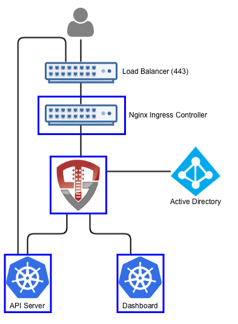

# Deploying The Authentication Portal

The authentication portal is the best place to start.  This guide is a step-by-step explination of each of the components
of the portal, what they do and how to configure them.  

## The Short Version

## Introductory Concepts

### Host Names and Networking

OpenUnison is a web application that can host multiple systems routed by host name.  If you ever worked with web servers,
this is similar to how virtual sites work.  When OpenUnison receives a request, it routes the request based on it's internal
configuration to the right application using the request's host name and URI path.  To prepare for using OpenUnison to 
manage access to your cluster, you'll need at least two host names:

1. Your OpenUnison portal host name
2. Your K8s Dashboard

If you're running OpenUnison on a managed cluster like EKS or GKE, you'll need a third host name specifically for the api service
that kubectl will use.  

***All of these host names must be different***

When your browser goes to `https://k8sou.domain.com/` it's going to a load balancer that forwards the traffic to your `Ingress`
controller.  Depending on your setup your load balancer may be a TLS termination point.  The `Ingress` controller is a TLS termination 
point that decrypts your request and forwards it to the `openunison-orchestra` `Service` which then forwards the packets to the
`openunison-orchestra` `Pod`.  The Helm chart sets all this up for you, so don't worry about having to wire everything yourself.

The dashboard works in a similar way.  Going to `https://k8sdb.domain.com/` goes through the same process as above.  Authentication
works by creating an OpenID Connect trust with `https://k8sou.domain.com/` to enable SSO.  This is why you don't need to setup multiple
connections to your identity system, OpenUnison has centralized authentication.  Once OpenUnison has authenticated you, it forwards
all requests to the dashboard with either your `id_token` or an [Impersonation](https://kubernetes.io/docs/reference/access-authn-authz/authentication/#user-impersonation)
header with your user's information.  Your dashboard runs without privileges, and without it's own `Ingress` object.  All traffic
runs through OpenUnison's reverse proxy.

When using OpenUnison with a managed cluster, such as EKS, you can enable impersonation for authentication to your cluster.
This scenario replaces your API server's host with the value from `network.api_server_host` routing all API requests through
OpenUnison.  OpenUnison authenticates your `id_token` and then injects Impersonation headers into each request.  This allows
you to authenticate to your cluster without getting cloud IAM credentials.  This process will be transparent to your tools, such
as kubectl.

### kubectl exec/cp/port-forward

The kubectl exec, cp, proxy, and port-forward commands use a protocol called SPDY.  This protocol was deprecated by Google in 2016.
Very few modern systems still support SPDY.  If using OpenUnison with a managed cluster like EKS, GKE, or AKS, OpenUnison will not directly support these kubectl commands.  Assuming your network infrastructure can support SPDY, you can enable the JetStack OIDC Proxy through
your values.yaml.

The terminal in the dashboard will work without issue, since the dashboard uses websockets intead of SPDY.

## Choosing an Identity Source

Before starting the deployment process, choose how you want to authenticate your users.  This is how OpenUnison will authenticate users,
regardless of how OpenUnison will integrate with your cluster.  Each authentication options includes pre-requisites that must be collected
before deployment.

### Active Directory / LDAP

OpenUnison collects your user's username and password, using an LDAP bind operation against your Active Directory or LDAP server.  This is
common in many enterprises.  The main advantage to this approach is it's simplicity.  It does however require that the user's password move
through OpenUnison.

To get started, you will need:

1. The full distinguished name and password for a service account.  This account needs no privileges.  The distinguished name will look something like `cn=serviceaccount,cn=Users,dc=domain,dc=com`
2. The host and port for your domain controllers OR the domain that you want to query.  OpenUnison doesn't know how to talk to multiple hosts, so you will either need to keep your domain controllers behind a load balancer or if your cluster is connected via DNS to the 
domain OpenUnison can use SRV records to discover domain controllers
3. The CA certificate for your domain controllers

Your domain controllers **MUST** have TLS enabled and running.  Most Active Directory deployments will not allow authentication over
a plaintext connection.

The following attributes must be available to OpenUnison:

| Attribute | Description | Example |
| --------- | ----------- | ------- |
| samAccountName | The user's login ID | mmosley |
| memberOf | The DN of all groups the user is a member of | cn=group1,cn=users,dc=domain,dc=com |

Additionally, users may also have:

| Attribute | Description | Example |
| --------- | ----------- | ------- |
| givenName | User's first name | Matt |
| sn | User's last name | Mossley |
| mail | User's email address | mmosley@tremolo.dev |
| displayName | The user's display name | Matt Mosley |

Any of these attribute names can be changed by [customizing the MyVirtualDirectory configuration](../knowledgebase/customizingmyvd) used by 
OpenUnison.

### OpenID Connect

The OpenID Connect protocol is a popular protocol used by Google, Okta, and many others.  It is a well documented standard.

### GitHub

### SAML2