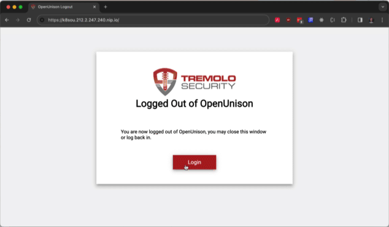
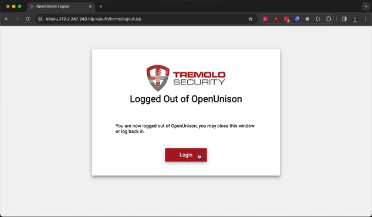

# Kubernetes Authentication and SSO

OpenUnison provides SSO and authentication for your Kubernetes clusters, no matter where they run or how your users need to authenticate.

**Simplify Access**

* Authentication for on-prem and cloud managed clusters
* Generates `kubectl` configuration on MacOS, Linux, and Windows
* Plugin for zero-configuration `kubectl` access
* Secure Dashboard Access
* Use identity provider's groups in RBAC `RoleBinding` and `ClusterRoleBinding` objects
* Works with cluster management applications such as ArgocD, Kiali, and more!

**Increase Security**

* Short-lived tokens transparently refresh with no impact on developers
* Logout of your web session invalidates your `kubectl` session
* Supports multiple clusters with a decentralized deployment

See how OpenUnison will increase the security of your clusters in addition to making your developers happy!

## kubectl SSO For Windows, Linux, and MacOS
The Orchestra portal provides kubectl commands for all of your user's operating systems.  Windows, Linux, and MacOS commands are all
generated.  The commands include certificates for your API server and OpenUnison portal, so there are no certificates to distribute!  These commands don't require you to pre-distribute a configuration file and work both locally and with remote jump boxes.

## kubectl Plugin

Skip the portal and get straight into `kubectl` with OpenUnison's `openunison-cli` plugin.  This plugin will launch a browser for you, authenticate you, and generate your entire `kubectl` configuration without pre-distributing a configuration file.  Simple as `kubectl openunison-cli`!  

##Secure Access To the Headlamp

OpenUnison provides secure access to Headlamp without creating service accounts.  Your identity is used by Headlamp
to interact with the API server, which means Headlamp runs without privileges of its own.  OpenUnison also has multiple options
for populating the namespaces filter and makes it easier to debug access issues by showing you the same who-am-i data from kubectl.
Whether your cluster is integrated via OpenID Connect, or you're running on a managed cluster, OpenUnison provides the easiest secure access
for Headlamp.

