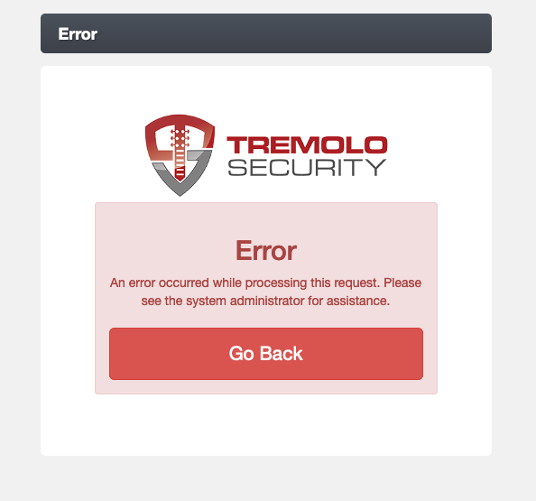

# Broken Dashboard Login

Once you've deployed OpenUnison, if you attempt to access the dashboard and see a screen that looks like:



The first step is to look in the logs for your `openunison-orchestra` container.  You'll likely see something like:

```
2022-03-15 13:02:48,894][XNIO-1 task-12] INFO  AccessLog - [Error] - dashboard - https://k8sdashboard.domain.com/auth/oidc - uid=Anonymous,o=Tremolo - NONE [10.197.32.134] - [f715f0f685458c392d744d0cd42d5aa2ed9104493]
[2022-03-15 13:02:48,894][XNIO-1 task-12] ERROR ConfigSys - Could not process request
```

This error is coming from when OpenUnison is attempting to authenticate you to `k8sdashboard.domain.com` using OpenID Connect, with your OpenUnison portal as the identity provider, and failing to be able to validate the authentication because it can't reach your OpenUnison portal via your load balancer.  This can happen when:

1. `NetworkPolicy`s restrict egress
2. Your load balancer's IP address isn't routable from inside of your cluster
3. DNS isn't resolving your OpenUnison host name

There are two ways to get past this error.  The first is to address the root cause.  This will be different in each scenario.  The second approach is to configure OpenUnison to use SAML2 between the dashboard and your OpenUnison portal.  SAML2 doesn't require communication directly from the OpenUnison `Pod` to its own load balancer.  All communication is performed through the user's browser so which ever of the above issues is causing authentication to fail, it will be avoided.  To configure SAML2 for the dashbard, update your values.yaml with `openunison.non_secret_data.K8S_DB_SSO=saml2`.  If you're using the default values.yaml it should look like:

```yaml
openunison:
  replicas: 1
  non_secret_data:
    K8S_DB_SSO: saml2
    PROMETHEUS_SERVICE_ACCOUNT: system:serviceaccount:monitoring:prometheus-k8s
    SHOW_PORTAL_ORGS: "false"
```

Then, upgrade your `orchestra-login-portal` deployment:

```bash
helm upgrade orchestra-login-portal tremolo/orchestra-login-portal -n openunison -f /path/to/values.yaml
```

There's no need to restart anything, the changes will be integrated automatically.

***NOTE***: If you integrate your cluster using OpenID Connect, you may still need to address the root cause as your cluster will attempt to reach OpenUnison via the load balancer as well.