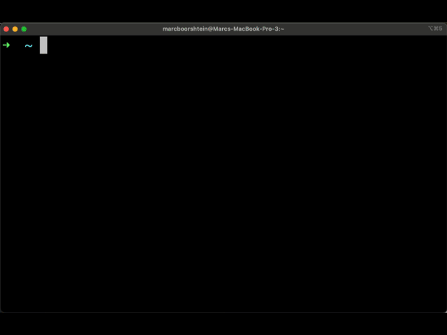

# Kubectl Plugin

The `openunison-cli` plugin makes it easier to access your clusters using OpenUnison without having to distribute a kubectl configuration file or logging into the OpenUnison portal first.  The plugin is an exec plugin that replaces the Kubernetes standard OIDC integration.  When your session expires or you need to re-authenticate, kubectl will pop open a browser window for you, authenticate you, then let you finish the command you wanted to execute.  Using this plugin eliminates the need to distribute and update kubectl configuration files to your developers and admins.




## Installation

The easiest way to deploy is using the [krew](https://krew.sh/) plugin manager:


```sh
kubectl krew install openunison-cli
```

Or directly from our krew configuration:

```sh
kubectl krew install --manifest-url=https://nexus.tremolo.io/repository/openunison-cli/openunison-cli.yaml
```

***NOTE:*** macOS arm64 is only provided starting with 1.4.0, which has not yet been accepted by krew.  Until that happen, you can use either the manual install or install the krew plugin directly from the manifest.

## Manual Installation
You can also manually download and install the plugins by adding them to your path and prefixing them with the name "kubectl-".  For instance, for MacOS:

```sh
wget https://nexus.tremolo.io/repository/openunison-cli/openunison-cli-v1.4.0-macos.zip
unzip openunison-cli-v1.4.0-macos.zip
mv openunison-cli kubectl-openunison-cli
```

Downloads are available for:

* [macOS - amd64](https://nexus.tremolo.io/repository/openunison-cli/openunison-cli-v1.4.0-macos.zip)
* [macOS - arm64](https://nexus.tremolo.io/repository/openunison-cli/openunison-cli-v1.4.0-macos-arm64.zip)
* [Linux](https://nexus.tremolo.io/repository/openunison-cli/openunison-cli-v1.4.0-linux.zip)
* [Windows](https://nexus.tremolo.io/repository/openunison-cli/openunison-cli-v1.4.0-win.zip)

## Usage

The `openunison-cli` plugin has a single user facing command that accepts a single argument: `login hostname` where `hostname` is the name of your OpenUnison host.  This should be the same as `network.openunison_host` in your values.yaml:

```sh
kubectl openunison-cli login k8sou.mydomain.lab
```

This will pop open your system browser to log you in to OpenUnison, then generate a kubectl configuration for you.  As you use kubectl. the plugin will continue to keep your tokens updated.  If your token expires while you're working, the plugin will pop open a new browser window automatically, no need to run the plugin again manually.

## FAQ

### What is the difference between this plugin and the oidc-login plugin?

The `oidc-login` plugin is a generic plugin that will work with any OpenID Connect identity provider.  It requires that you pre-configure kubectl for use with the OpenID Connect identity provider.  The `openunison-cli` plugin is designed to work with OpenUnison and creates your kubectl configuration for you.  There's nothing to pre-configure on the client and no kubectl configuration files to distribute.

### Does the `openunison-cli` plugin use kubectl's OIDC implementation?

No.  The `openunison-cli` plugin is an independent OIDC implementation from kubectl.  This allows us to keep the libraries up to date independent of kubectl.  

### Can I use the kubectl configuration generated by `openunison-cli` with my scripts?

As of now, the Go lang, Java, Python, and TypeScript SDKs support exec plugins.  The .Net SDK does not.

### The login process complains about not trusting a certificate, can I use an untrusted cert?

You can use the `--cacert-path` argument to supply the path to your CA certificate or `--cacert-base64` to supply the a base64 encoded PEM of your CA directly from the command line.

### Can I Use `openunison-cli` With Multiple Clusters?

Yes.  If you run `kubectl openunison-cli login cluster1` it will set your cluster configuration for cluster1.  If you then run `kubectl  openunison-cli login cluster2` if will set your configuration for cluster2.  You can then switch clusters using normal kubectl commands.


