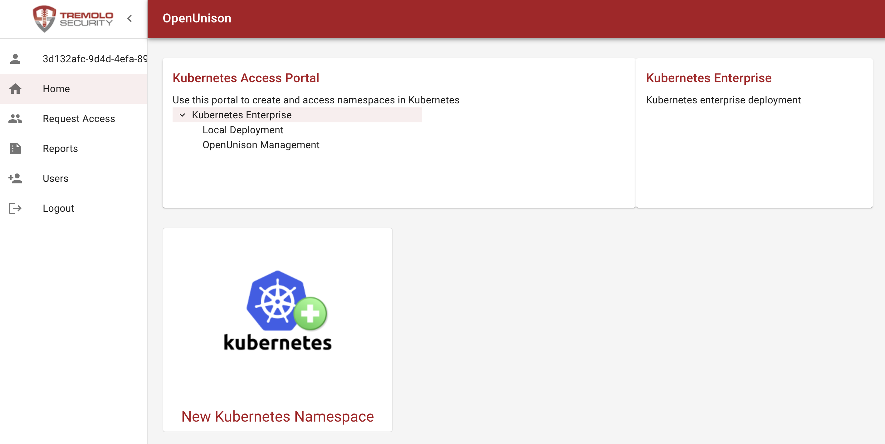

# Namespace as a Service

Once you have authentication working for your cluster, often the next question is "How do I provision workloads?".
A simple way to get started is to provide *Namespace as a Service*, or *NaaS*, so your users can request their
own namespaces be created and let them manage access as needed.  The login portal you've created can be extended
to support self service NaaS portal where `Namespaces`, `RoleBindings`, and other management objects like 
default `NetowrkPolicy` and `ResourceQuota` objects can be created automatically.  Default labels and annotations
can also be added to support your reporting needs.

## Deploying The NaaS Portal

## Before You Deploy

Before moving forward, you will need two additional components are required:

1. Relational Database (right now MySQL or MariaDB, more will be supported soon)
2. An SMTP server for notifications

### Testing MariaDB

If you need a simple database implementation for testing, this [MariaDB deployment can be used](https://raw.githubusercontent.com/OpenUnison/kubeconeu/main/src/main/yaml/mariadb_k8s.yaml).  If you use this database, use the following configuration information:

| Configuration Option | Value |
| ---- | -------------------- |
| Host | `mariadb.mariadb.svc` |
| Port  | `3306` |
| User Name | `unison` |
| Password | `startt123` |
| Database Name | `unison` |

### Testing SMTP Server

If you don't have an SMTP server available, you can use the SMTP Blackhole we created to have a place to send email
without forwarding it to any recipients:

```
kubectl create ns blackhole
kubectl create deployment blackhole --image=tremolosecurity/smtp-blackhole -n blackhole
kubectl expose deployment/blackhole --type=ClusterIP --port 1025 --target-port=1025 -n blackhole
```

If you use the blackhole smtp service, use the following configuration information:

| Configuration Option | Value |
| -------------------- | ----- |
| Host | `blackhole.blackhole.svc` |
| Port | `1025` |
| Username | none |
| Password | none |
| TLS | `false` |

## Deployment

Once you have your [Authentication Portal](../deployauth/), database, and SMTP server deployed the next step is to
 add your database password and SMTP password to your `orchestra-secrets-source` `Secret` in the openunison namespace.  Assuming
you're using the testing MariaDB and SMTP Blackhole from above:

```
kubectl patch secret orchestra-secrets-source -n openunison --patch '{"data":{"OU_JDBC_PASSWORD":"c3RhcnR0MTIz","SMTP_PASSWORD":"ZG9lc25vdG1hdHRlcg=="}}'
```

Next, update your values.yaml by setting `openunison.enable_provisioning: true`, adding the below `az_rules`, and uncommenting the `database` and `smtp` sections of your values.yaml.
As an example, the below will work with the testing database and SMTP server:

```
openunison:
  enable_provisioning: true
  use_standard_jit_workflow: false
  az_groups:
  - k8s-cluster-k8s-administrators
  - k8s-namespace-administrators-k8s-*
  - k8s-namespace-viewer-k8s-*

database:
  hibernate_dialect: org.hibernate.dialect.MySQL5InnoDBDialect
  quartz_dialect: org.quartz.impl.jdbcjobstore.StdJDBCDelegate
  driver: com.mysql.jdbc.Driver
  url: jdbc:mysql://mariadb.mariadb.svc:3306/unison
  user: unison
  validation: SELECT 1

smtp:
  host: blackhole.blackhole.svc.cluster.local
  port: 1025
  user: "none"
  from: donotreply@domain.com
  tls: false
```

Next, update the orcehstra chart:

```
helm upgrade orchestra tremolo-betas/orchestra --namespace openunison -f /path/to/values.yaml
```

Wait for openunison-orchestra to finish creating and for your old container deployment.

***This will take much longer then the orchestra login portal alone.  The orchestra portal needs to wait for ActiveMQ to be available.***

Once done, update the `orchestra-login-portal` chart:

```
helm upgrade orchestra-login-portal tremolo-betas/orchestra-login-portal --namespace openunison -f /path/to/values.yaml
```

Next, login to your portal.  You'll see two "badges":



*ActiveMQ Console* - How you can view messages in queues, move messages from the dead letter queue.

*Operator's Console* - Search for users and apply workflows directly

You see these badges because the first user to login is provisioned as an administrator.  The dashboard and tokens are not there because you haven't yet been authorized for access to the cluster.  Your second, third, fourth, user, etc that logs in will not see any badges.

There are multiple ways for you to provision namespaces.  Find the option you want to determine how to provision namespaces and gain access to them.

## NaaS Models

### Local Management Self Service

The local management self service model will create a `Namespace` and groups inside of OpenUnison's database for namespace administrators, namespace viewers, and
namespace approvers.  There's no connection to your enterprise directory store and everything is self contained.  Users get access to namespace roles by
requesting access through the portal.  Namespace approvers can approve, or deny, the access.  New namespaces are requested from inside of the portal,
with openunison administrators being able to approve the namespace's creation.

To deploy the local management self service model:

```
helm install cluster-management tremolo-betas/openunison-k8s-cluster-management -n openunison -f /path/to/values.yaml
```

### Authentication Groups

This model lets you use groups from your central authentication store to control who has access to namespaces.  When a namespace is requested and approved, `RoleBinding` objects are created that map to your central authentication store.  When using LDAP or Active Directory, you're able to pick groups.  When using OpenID Connect, SAML2, or GitHub you need to type in the names of the groups.  

Unlike the ***Local Management Self Service*** NaaS, this mode does not use workflows to provide access to individual namespaces.  All namespace access is governed by your centralized groups.

To deploy the authentication groups model, add two keys to the `openunison` section to govern which users will be OpenUnison administrators (can approve the creation of new namespaces), and who is a cluster administrator.  If you're using Active Directory, make sure to use the value fo the group's `distinguishedName` attribute. 

As an example for Active Directory:

```
openunison:
  adminGroup: "CN=openunison-admins,CN=Users,DC=ent2k12,DC=domain,DC=com"
  clusterAdminGroup: "CN=k8s_login_ckuster_admins,CN=Users,DC=ent2k12,DC=domain,DC=com"
```

And for Okta:

```
openunison:
  adminGroup: "k8s-openunison-admins"
  clusterAdminGroup: "k8s-cluster-admins"
```

Finally, deploy the helm chart:

```
helm install orchestra-k8s-cluster-management-by-group tremolo-betas/openunison-k8s-cluster-management-by-group -n openunison -f /path/to/openunison.values
```